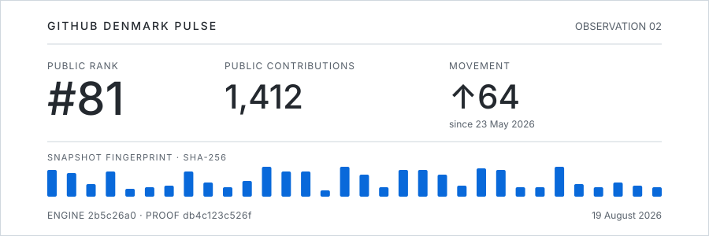
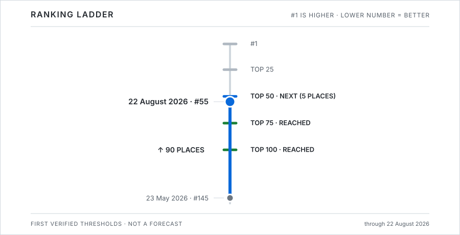
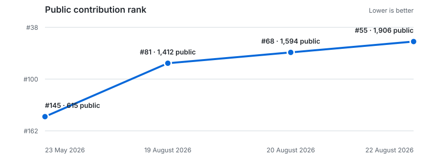

# GitHub Denmark Pulse

A compact, evidence-backed history of
[`Daniele-Cangi`](https://github.com/Daniele-Cangi) in the Denmark ranking.

*Built quietly. Now measurable.*

<!-- latest:start -->
| Public rank | Public contributions | Movement since 23 May 2026 |
| ---: | ---: | ---: |
| **#55** | **1,906** | **↑ 90 places** |

Captured 22 August 2026. Secondary measures: **#66** by total contributions
(4,062, including 2,156 restricted contributions) and **#119** by followers
(289). [Inspect the snapshot](snapshots/2026-08-22.json).
<!-- latest:end -->

The fingerprint bars and proof prefix are deterministically derived from the
latest snapshot hash. They identify the snapshot; they do not encode time or
direction. Each dated JSON links to the canonical SHA-256 of its predecessor,
forming a small tamper-evident chain that `npm run verify` checks end to end.

## Ranking ladder

`#1` is at the top, so movement upward means a better position. Thresholds are
logged only when a dated snapshot verifies them.

## Milestone log

<!-- milestones:start -->
| Milestone | First verified observation | Observed rank | Evidence |
| --- | --- | ---: | --- |
| **Top 100** | 19 August 2026 | #81 | [Snapshot](snapshots/2026-08-19.json) |
| **Top 75** | 20 August 2026 | #68 | [Snapshot](snapshots/2026-08-20.json) |

**Next:** Top 50 — **5 places** away.
<!-- milestones:end -->

## Trajectory

## Recorded history

<!-- history:start -->
| Date | Public rank | Public contributions | Change |
| --- | ---: | ---: | ---: |
| 23 May 2026 | #145 | 615 | baseline |
| 19 August 2026 | #81 | 1,412 | +64 places |
| 20 August 2026 | #68 | 1,594 | +13 places |
| 22 August 2026 | #55 | 1,906 | +13 places |
<!-- history:end -->

The chart is deliberately a trajectory, not a forecast. It connects two
verified observations and makes no claim about the unobserved days between
them. The full append-only record is in [`data/history.csv`](data/history.csv).

## How a capture works

The manual-only workflow runs the upstream Denmark ranking with the same
country configuration and a ranking engine fixed to an exact commit. It then
checks every generated row against the cache before updating the small history
layer in this repository. It also links the new snapshot to its predecessor and
regenerates all GitHub-native SVGs and the milestone log.

For definitions, validation rules, reproducibility instructions, and known
limits, read [`docs/METHODOLOGY.md`](docs/METHODOLOGY.md). The original August
run remains available as [workflow evidence](https://github.com/Daniele-Cangi/top-github-users/actions/runs/32272528671).

## Attribution and license

Ranking data and generation are credited to
[`gayanvoice/top-github-users`](https://github.com/gayanvoice/top-github-users)
and [`gayanvoice/top-github-users-action`](https://github.com/gayanvoice/top-github-users-action).
This presentation layer is MIT-licensed. Details are in
[`THIRD_PARTY_NOTICES.md`](THIRD_PARTY_NOTICES.md).
